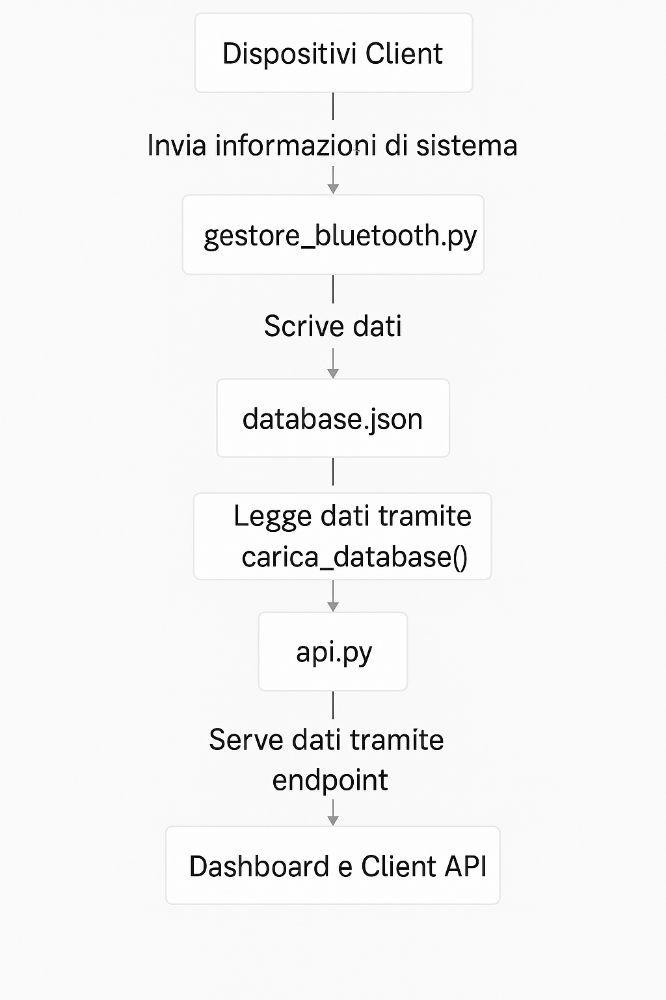

# Galilei Control - Architettura 

Il sistema Galilei Control è diviso in server e client. L'architettura del server è a sua volta divisa in frontend e backend.


## Client

Il componente client raccoglie e invia dati di sistema al server.

 **get_data.py**: Raccoglie informazioni sul sistema, come:
  - Data e ora
  - Temperatura della CPU
  - Utilizzo della RAM
  - Stato della connettività Internet
  - Informazioni su utente e nome host 
 é facilmente estensibile per includere altre metriche, basta aggiungere nuove fuznioni.


- **client.py**: Stabilisce una connessione Bluetooth con il server e invia periodicamente (5s) dati di sistema. Utilizza la libreria socket, perchè non necessita dei funzionalità avanzate del bluetooth, ma solo l'invio di dati con RFCOMM. L'indirizzo del server è definito nel codice, va manualmente cambiato per ogni client. 


## Architettura Backend

Il backend del server gestisce la comunicazione Bluetooth con i dispositivi client e comprende tre file principali:

- **server.py**: Gestore del server che inizializza il server Bluetooth, usando le funzioni di . 

- **gestore_bluetooth.py**: Il componente centrale che:
  - Inizializza un socket Bluetooth RFCOMM
  - Pubblicizza il servizio con uno specifico UUID
  - Gestisce le connessioni client. Viene creato un thread per ogni client connesso, che esegue la funzione `gestione_client`
  - Elabora i dati ricevuti, tramite la funzione `elabora_dati` chiamata da `gestione_client`
  - gestisce la disconnessione dei client e la chiusura del socket Bluetooth


## Database 

Quando i dati vengono ricevuti dai client, sono elaborati e memorizzati in un "database" JSON. Se i dati per un dispositivo sono già presenti, vengono aggiornati. Se il dispositivo è nuovo, viene creato aggiunto. La struttura del database è la seguente:

```json
{
  "dispositivi": {
    "hostname1": {
      "data": "2023-10-01 12:00:00",
      "cpu_temp": 45,
      "ram_usage": 30,
      "internet_status": true
    },
    "hostname2": {
      "data": "2023-10-01 12:00:05",
      "cpu_temp": 50,
      "ram_usage": 40,
      "internet_status": false
    }
  }
}
```

La struttura non è rigida, quindi è possibile aggiungere altri campi. I dati vengono memorizzati in un file JSON chiamato `database.json`.


## Componente Frontend (API)

Il componente frontend fornisce un'API HTTP REST implementata con Flask che espone i dati raccolti:

- **api.py**: Implementa diversi endpoint:
  - `/api/dispositivi/nomi` - Elenca tutti i nomi host dei dispositivi
  - `/api/dispositivi/<hostname>` - Restituisce i dati per un dispositivo specifico
  - `/api/status` - Indica se qualche dispositivo è in stato critico (temperatura CPU > 70°C, necessario configurare la logica in base alle esigenze)
  - `/api/test` - Verifica la funzionalità dell'API e l'accessibilità del database

Il server API funziona sulla porta 5000 ed è accessibile da qualsiasi host sulla rete.
In questa dimostrazione non sono implementate misure di sicurezza, quindi l'API è accessibile a chiunque sulla rete.
Inoltre non gli viene assoociato un ip statico, ma viene usato il primo disponibile (`0.0.0.0`)

## Componente Dashboard

Piccolla dimostrazione di utilizzo dell'api.
La dashboard fornisce un feedback visivo sullo stato del sistema attraverso:

- **dashbordInterface.py**: Interroga l'API e comunica con l'hardware Arduino:
  - Effettua richieste a `/api/status` per determinare lo stato del sistema
  - Invia comandi a un controller Arduino tramite comunicazione seriale 

- **dashboard.ino**: Codice Arduino che controlla i LED RGB in base ai comandi ricevuti:
  - Interpreta i comandi seriali per impostare i colori dei LED


## Flusso dei Dati del Sistema

Il flusso di lavoro completo del sistema segue questa sequenza:

1. I client raccolgono metriche di sistema (temperatura CPU, utilizzo RAM, connettività Internet)
2. Questi dati vengono trasmessi al server tramite il protocollo Bluetooth RFCOMM
3. Il server elabora e memorizza i dati in un database JSON
4. L'API espone i dati elaborati attraverso endpoint HTTP
5. La dashboard interroga lo stato dell'API e lo visualizza attraverso indicatori LED